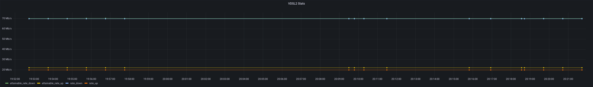

# plusnet_monitoring

This is a small python app which can pull DSL sync statistics from a Plusnet Hub 2 router and send the stats to InfluxDB.
Its been tested when the router is in "bridge mode" so non-DSL sync stuff hasnt been verified. It **doesn't** work on the 
BT Smarthub 2 (slightly different firmware which doesnt expose the `/nonAuth/wan_conn.xml` endpoint)

Thanks to @hamishcoleman who did something [similar](https://github.com/hamishcoleman/monitor_bt_smarthub) in perl.

## Running

You have a few options if you want to run this yourself...

- clone the repo, install the python dependencies listed in the `requirements.txt` file and run `monitor.py`
- run the docker image either periodically from cron, something like the below. Change `podman` for `docker` if you're still on old-school docker...

    `podman run -e INFLUX_DB=modemstats -e ROUTER_IP=modem.lan -e INFLUX_HOST=10.43.238.72 ghcr.io/potchin/plusnet_monitoring:main`
- run the image in the background with the a `REPORT_INTERVAL` value. This will leave the container running..

    `podman run -d -e REPORT_INTERVAL=60 -e ROUTER_IP=modem.lan -e INFLUX_HOST=10.43.238.72 ghcr.io/potchin/plusnet_monitoring:main`
- run as a cron job inside kubernetes (see [example](k8s_manifest.yml))


## Configuration

The script is designed to run in a docker container so all config is read from the environment:

| Variable    | Default | Description |
--------------|---------|--------------
|`ROUTER_IP`  | `192.168.1.254` | hostname/IP of your router. |
|`INFLUX_HOST`| None | Hostname/IP of machine running influxdb |
|`INFLUX_PORT`| `8086` | port to connect to influxdb|
|`INFLUX_USER`| `root` | InfluxDB username |
|`INFLUX_PASS`| `root` | InfluxDB password |
|`INFLUX_DB`  | `routerstats` | InfluxDB database |
|`REPORT_INTERVAL`  | 0 | How often (in seconds) to grab stats, set to 0 to send stats once then exit (useful for cron) |


## Viewing

If you have InfluxDb then you've probably heard of [Grafana](https://grafana.com/). Use that...



If you're down with the kids and run [Home Assistant](https://www.home-assistant.io/) then you can also create sensors with
the latest value from InfluxDB with something like...

```
sensor:
  - platform: influxdb
    host: influxdb
    port: 8086
    queries:
      - name: dsl_rate_down
        unit_of_measurement: "Mbit/sec"
        value_template: "{{ (int(value) /1024) | round(1) }}"
        where:  'time >= now() - 1h'
        measurement: rate_down
        field: "value"
        group_function: last
        database: routerstats
      - name: dsl_rate_up
        unit_of_measurement: "Mbit/sec"
        value_template: "{{ (int(value) /1024) | round(1) }}"
        where:  'time >= now() - 1h'
        measurement: rate_up
        field: "value"
        group_function: last
        database: routerstats
      - name: dsl_attainable_rate_down
        unit_of_measurement: "Mbit/sec"
        value_template: "{{ (int(value) /1024) | round(1) }}"
        where:  'time >= now() - 1h'
        measurement: attainable_rate_down
        field: "value"
        group_function: last
        database: routerstats
      - name: dsl_attainable_rate_up
        unit_of_measurement: "Mbit/sec"
        value_template: "{{ (int(value) /1024) | round(1)}}"
        where:  'time >= now() - 1h'
        measurement: attainable_rate_up
        field: "value"
        group_function: last
        database: routerstats
```
